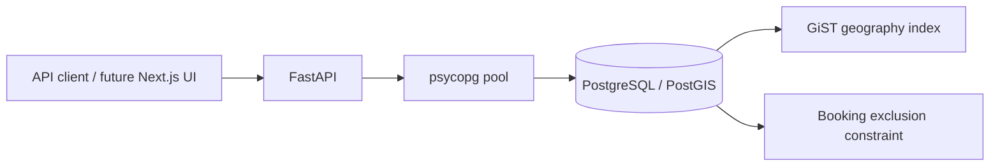

# Architecture decisions

## Transaction authority

FastAPI provides validation and account checks. A psycopg connection pool serves synchronous
handlers. Connections use autocommit for reads; each mutating multi-step handler starts an
explicit transaction and commits before returning a success result. PostgreSQL is authoritative
for reservation exclusivity across every API process.

`no_overlapping_bookings` excludes equal listing IDs with overlapping half-open
`tstzrange(starts_at, ends_at, '[)')` values for confirmed bookings. The database waits on
uncommitted conflicts and rejects a loser. The API maps this exclusion violation to HTTP 409.
Back-to-back reservations are valid because the end boundary is excluded. Availability search
is a convenience; its result never guarantees that a later reservation will still succeed.

## Requests, retries and ownership

The server derives the customer from a stored session, not from a request body. A listing's
owner is similarly server-derived. Listing status updates require the owner; booking reads
and cancellation require the booking customer. Customers cannot reserve their own listing.

Reservation retries use a UUID scoped to the customer, with a unique constraint on
`(customer_id, request_id)`. The customer's account row is locked before checking a key,
so concurrent retries across different listings cannot race. The same payload returns the
existing booking; a changed payload returns 409. A retry after cancellation returns the
cancelled booking. Failed transactions do not consume the key.

This serializes a customer's concurrent booking requests. It is a deliberate initial tradeoff,
not a claim of maximum throughput. A shared lock on the listing coordinates reservation with
owner deactivation. Cancellation locks its booking row and atomically changes its status.
No payment processing occurs in these transactions.

## Location search and money

Coordinates are stored as `geography(Point, 4326)`. `ST_DWithin` uses meters and a partial
GiST index on active listings. Results are ordered by distance and listing ID and bounded
to 100. Search excludes confirmed interval conflicts. Radius is capped at 50 km.
The schema contains an index, but index selection and latency on a realistic dataset must
still be demonstrated with query plans and benchmarks.

Prices are integer cents. The server computes the charge from stored hourly price and
elapsed microseconds using decimal arithmetic and rounds up once. The result is stored
on the booking so later pricing changes cannot rewrite its recorded quote.
Intervals are normalized to UTC. The database's 30-day limit compares elapsed duration
to 720 hours, so its outcome does not depend on the connection's timezone or daylight saving.

## Migrations and operation

The migration runner acquires a transaction-scoped advisory lock, verifies previously applied
SHA-256 digests, and applies all pending ordered SQL files in one transaction. Editing an applied
migration fails closed; upgrades require a new numbered file. Connection waits, statements and
locks have timeouts. Recovery, backup restore, connection saturation and multi-instance load
have not yet been exercised. Infrastructure failures are not falsely reported as booking conflicts.
